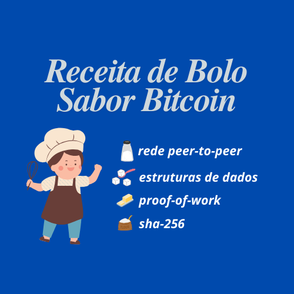

## Introdução
O vídeo *[Algorítimos de Consenso, Tecnologia Blockchain e Bitcoin - por Andreas M. Antonopoulos](https://www.youtube.com/watch?v=fw3WkySh_Ho)*, apresenta uma palestra acadêmica realizada na Universidade College de Londres. Na palestra, Antonopoulos explica a combinação única de tecnologias que compõem a arquitetura e o design do Bitcoin. Ele detalha o mecanismo de proof-of-work (prova de trabalho) que sustenta a função de segurança do Bitcoin e como os mineradores gastam enormes quantidades de energia para validar as regras de consenso. Antonopoulos também discute a importância dos algoritmos de consenso na criação de um sistema distribuído no qual os nós podem entrar e sair sem comprometer a autenticidade da blockchain. Além disso, ele fala sobre o processo pelo qual os mineradores competem para construir um bloco e como o mecanismo de votação ocorre por meio da aplicação do poder de mineração. Por fim, Antonopoulos aborda considerações importantes na mineração, como o custo da eletricidade e redes de baixa latência, e um bug que ocorreu no passado quando uma nova versão do Bitcoin foi lançada.

## Estrutura do Bitcoin
Em sua apresentação sobre o mecanismo de consenso do Bitcoin, ele explica como é uma combinação única de várias tecnologias que já existiam antes da criação do Bitcoin. Ele destaca como a arquitetura e as características de design do Bitcoin o diferenciam de outras tecnologias e o compara a uma receita, onde todos os ingredientes já existiam, mas nunca haviam sido combinados dessa maneira específica. Ele também explica a importância da função de hash criptográfico sha-256, que é usada no Bitcoin para produzir uma saída de tamanho fixo que atua como uma impressão digital dos dados."

Ele explica o proof-of-work, o mecanismo de consenso fundamental por trás do Bitcoin. O proof-of-work envolve o usuário realizar um determinado número de operações para produzir uma 'impressão digital' antes de poder postar uma mensagem no quadro de mensagens. Para um usuário legítimo, esse processo computacional leva menos de um segundo, mas para um spammer que deseja enviar milhões de mensagens, torna-se muito mais difícil e demorado. Esse mecanismo é como o consenso global é alcançado na rede descentralizada. Satoshi Nakamoto combinou o mecanismo de proof-of-work com uma rede peer-to-peer que criou um sistema de dinheiro digital, e essa invenção foi o núcleo do Bitcoin.

O funcionamento do **SHA-256** também é explicado, usando o exemplo da frase *'hello exclamation mark'* para produzir uma impressão digital ou hash única. Ele explica como a mudança de um único elemento da entrada, como adicionar um espaço ou um número, resulta em uma saída completamente diferente. Antonopoulos também explica como encontrar um número aleatório específico ou qualquer número que possa gerar um hash que atenda a um alvo de dificuldade desejado. Para isso, é necessário forçar todas as possíveis combinações de números até que o hash desejado seja obtido.

Ele explica o conceito de proof-of-work, essencial para a tecnologia blockchain. Ele descreve como os mineradores buscam um hash criptográfico por meio de operações de força bruta. Antonopoulos relaciona os cálculos de hash ao gasto de energia e à dissipação de calor, argumentando que, à medida que a dificuldade de encontrar uma impressão digital específica aumenta, os mineradores consomem mais energia. Antonopoulos estima que o hardware necessário para realizar quadrilhões de hashes provavelmente seja um chip de fabricação de 20 nanômetros com centenas de milhares de motores sha-256 em paralelo. Ele conclui que a única maneira de criar uma impressão digital é realizando o trabalho necessário, tornando o sistema praticamente impossível de ser hackeado.

## Algoritmos de Consenso
Em sua palestra sobre algoritmos de consenso, tecnologia blockchain e Bitcoin, ele explica como o algoritmo de consenso do Bitcoin utiliza eletricidade para sustentar sua função de segurança. Os mineradores investem grandes quantidades de esforço e custo para participar desse sistema, pois a recompensa é determinada pelo cumprimento das regras de consenso. A cada 10 minutos, os mineradores precisam construir um bloco com transações que seguem as 30-40 regras estabelecidas por todos. Em seguida, devem encontrar um "nonce" que faça a impressão digital (fingerprint) do cabeçalho do bloco ter uma aparência específica. Se eles encontrarem o nonce e o enviarem para o restante da rede, mas ele não atender às regras de consenso, toda a eletricidade utilizada terá sido desperdiçada. 

### Coinbase
Para incentivar os mineradores a validar as regras de consenso, cada bloco contém uma transação única, chamada transação coinbase, que paga ao minerador 25 bitcoins completamente novos e que nunca existiram antes. Isso cria um equilíbrio teórico de jogos e alinha os interesses dos mineradores com a validação das regras de consenso.

---

Ele explica o processo de validação de blocos e consenso na rede Bitcoin. As regras de validação são definidas pelo software da implementação de referência, que inclui um conjunto de funções que avaliam o processo de validação de blocos e transações com base em um conjunto de regras. No entanto, essas regras estão documentadas apenas na linguagem C++ na implementação central, que inclui todos os bugs encontrados desde 2009. O processo de tomada de decisão para o consenso na rede é descentralizado e baseado em uma votação através da cadeia de maior dificuldade, que é a sequência de blocos que contém o hash do bloco anterior, criando um efeito cascata se qualquer bloco for alterado.

Ele discute a importância do algoritmo de consenso do Bitcoin e como ele permite um sistema distribuído no qual os nós podem entrar e sair à vontade sem comprometer a autenticidade da blockchain. Com o algoritmo, é possível validar cada bloco, vinculando-o aos blocos anteriores até o bloco Gênesis e confirmando que o proof-of-work foi realizado. Antonopoulos também explica como os mineradores que trabalham em diferentes partes da cadeia conseguem chegar a um consenso estimando a dificuldade cumulativa total representada por todo o proof-of-work realizado em todos os blocos. Essa propriedade garante que a blockchain permaneça segura e autêntica, independentemente da localização e das ações dos mineradores individuais.

Ele explica o processo pelo qual os mineradores competem para construir um bloco. Os mineradores começam a construir blocos candidatos assim que recebem o bloco anterior e, ao receberem um bloco de outro minerador, o validam o mais rápido possível e começam a construir um novo bloco em cima dele. Quando um minerador encontra um nonce que comprova o proof-of-work, ele comunica a todos e começa a propagar essa informação para todos os nós conectados a ele, para que seu bloco seja reconhecido mundialmente. No caso de dois blocos válidos serem minerados ao mesmo tempo, ocorre um fork (bifurcação), e apenas uma versão da blockchain pode prevalecer.

Ele explica que não há um mecanismo de votação no Bitcoin; em vez disso, a votação ocorre por meio da aplicação do poder de mineração. Quando um minerador recebe um bloco, ele começa a trabalhar no próximo o mais rápido que pode, efetivamente votando naquele bloco com seu poder de hashing. Se dois mineradores encontrarem simultaneamente um bloco com base em blocos pais diferentes, a rede eventualmente reconhecerá a cadeia mais longa e irá orfanizar a cadeia mais curta, com suas transações sendo adicionadas à cadeia mais longa e vencedora.

Ele explica a importância dos algoritmos de consenso no Bitcoin e na tecnologia blockchain. Ele usa o exemplo de uma "corrida" entre dois lados da rede para ilustrar a convergência eventual desencadeada pela descoberta do próximo bloco, que força a validação da cadeia mais longa. Toda a rede então converge para a cadeia mais longa e vota novamente ao construir sobre ela. Embora existam mecanismos de consenso concorrentes, o Bitcoin utiliza um algoritmo simplista que cria uma história geológica de transações. O algoritmo de consenso cria camadas geológicas de transações e torna mais difícil alterar uma cadeia de transações mais profunda. O algoritmo também permite que blocos sejam modificados se tiverem menos de 144 blocos de idade.

Existem diferentes tipos de algoritmos de consenso. Veja abaixo:

| Nome | Descrição |
| ----------- | ----------- |
| Proof of Work | Algoritmo de consenso mais popular existente. Bitcoin, Litecoin e Ethereum o utilizam. Ele foi criado pela primeira vez por Satoshi Nakamoto quando foi implementado no Bitcoin. No entanto, é também a maneira mais ineficiente de se alcançar consenso em uma blockchain, pois requer uma quantidade considerável de poder computacional. O funcionamento se dá ao solicitar que os mineradores resolvam problemas matemáticos complexos. Uma vez que o hash é resolvido, o bloco é minerado e a transação é validada ao mesmo tempo. |
| Proof of Stake | O próximo algoritmo de consenso mais popular, ele é utilizado por Peercoin, Decred e em breve pelo Ethereum. O funcionamento se dá pelo "staking" de moedas em uma carteira. Os nós que possuem suas moedas apostadas terão voz quando for necessário alcançar um consenso. A grande vantagem do PoS é que ele não consome tanta energia computacional. O recurso gasto, nesse caso, são os próprios tokens. Se um nó que está em staking não votar pela transação correta, ele perderá sua aposta. Se tiver sucesso, terá melhores chances de participar do staking em uma próxima transação. Assim como outros algoritmos de consenso, o PoS também possui suas fraquezas. Uma delas é o problema do “Nothing at Stake”, que ocorre quando há validação de ambos os lados de uma bifurcação. Recentemente, escrevemos sobre a diferença entre PoW e PoS. |
| Delegated Proof of Stake | Pode soar semelhante ao Proof of Stake (PoS), mas é diferente em sua abordagem. A primeira coisa que os diferencia é que o DPoS não é totalmente descentralizado. Nesse sistema, os apostadores não validam os blocos, mas escolhem delegados. Esses delegados, por sua vez, validam cada transação. Geralmente, qualquer sistema descentralizado tem de 20 a 21 delegados que verificam as transações. Isso torna o DPoS excepcionalmente eficiente e é utilizado por plataformas como EOS, Steemit e outras. |
| Proof-of-Authority Consensus Algorithm | Ele é utilizado em sistemas totalmente centralizados. Isso significa que contas aprovadas (escolhidas pelos administradores do sistema) realizam as validações em toda a rede. É principalmente utilizado em redes privadas devido à sua natureza centralizada. |

## Controvérsias
Ele discute as considerações importantes na mineração, como o custo da eletricidade e a necessidade de redes de baixa latência. A eficiência do equipamento de mineração é limitada pela Lei de Moore, mas o incentivo econômico por trás da mineração de Bitcoin impulsionou o desenvolvimento da fabricação de silício. À medida que o tamanho do bloco aumenta, isso coloca os mineradores chineses em desvantagem devido a problemas de largura de banda. Em média, uma bifurcação ocorre uma vez por dia, mas bifurcações mais longas são raras devido à probabilidade exponencial de que elas ocorram no algoritmo de consenso.

## Bug
Ele discute um bug que ocorreu quando uma nova versão do Bitcoin foi lançada, utilizando o LevelDB do Google em vez do Berkeley DB para o armazenamento de blocos. Em abril de 2013, uma máquina conseguiu criar um bloco com 1.200 transações, o que causou uma bifurcação na rede, pois os nós adaptados ao LevelDB não conseguiam consumir blocos criados no Berkeley DB, resultando em uma bifurcação completa. Isso levou a uma cúpula de emergência durante a noite, e pela manhã, todos os operadores de mineração conseguiram redirecionar o poder de hashing de volta para a primeira bifurcação e invalidar a cadeia mais longa de 26 blocos, enquanto ainda processavam todas as transações, incluindo gastos duplos.

## Papel do Mecanismo de Consenso
Ele discute o mecanismo de consenso e seu papel na rede Bitcoin. Ele explica como o BIP 66, uma atualização proposta para o processamento das regras de consenso, foi introduzido para corrigir os problemas causados por bugs do OpenSSL e pela maleabilidade das transações. O BIP 66 restringiu a gama de possibilidades e assinaturas, o que significava que algumas transações anteriormente válidas se tornaram inválidas. Assim que 75% dos mineradores apoiassem o BIP 66, ele entraria em vigor. Antonopoulos explica que os mineradores que recebiam blocos estavam trapaceando, pois não estavam validando todas as transações. Essa falta de validação resultou em um evento de bifurcação que durou seis blocos, fazendo com que os mineradores que tomaram um atalho perdessem $50.000 em recompensas de Bitcoin ao longo desses blocos.

Ele discute as consequências de ir contra o consenso na rede Bitcoin, bem como o conceito de bifurcações e autocura na rede. Ele explica que, se um participante da rede agir contra o consenso, estará queimando eletricidade à toa e pagará por isso. Antonopoulos menciona que o BIP 66 ainda causou instabilidade na rede, mas que a rede é autoconsertável e as transações serão sequenciadas corretamente e continuarão uma vez que as bifurcações sejam resolvidas. Ele também observa que existem outros mecanismos de consenso sendo idealizados, mas, para escalá-los a um nível global de segurança que seja resistente a ataques globais, deve-se construir uma infraestrutura industrial de hashing ou mineração, ou uma base de adoção de usuários grande o suficiente para resistir a ataques antes que eles ocorram.

## Considerações Finais
Ele explica a evolução dos algoritmos de consenso na rede Bitcoin. Ele destaca que os algoritmos de consenso agora se tornaram uma nova disciplina científica, com dezenas de pesquisadores trabalhando nisso em todo o mundo. Andreas aborda o "consenso de processo" e o "consenso em tempo de execução" que ocorrem entre a comunidade de desenvolvimento antes que o software seja atualizado. O consentimento de mineradores, exchanges, provedores de carteira e comerciantes também é crucial para introduzir mudanças na rede. Além disso, Andreas explica a importância do consenso na criação de novas redes de criptomoedas e como se tornou difícil, dado o valor que essas redes adquiriram.

Ele discute a dificuldade de modificar as regras de consenso no Bitcoin e como o protocolo gradualmente se torna "ossificado" ao longo do tempo, tornando mais difícil realizar mudanças drásticas. Ele dá o exemplo do protocolo IPv4, que, após duas décadas, ainda é difícil de atualizar para o IPv6, pois está embutido em vários sistemas, como geladeiras e interruptores de luz. Antonopoulos acredita que a maior parte da inovação no Bitcoin se deslocará para camadas de protocolo acima do núcleo, uma vez que as regras de consenso no nível do protocolo central podem absorver mudanças por mais alguns anos. Aumentar o limite do tamanho do bloco para 8 megabytes até janeiro de 2016, e dobrá-lo a cada quatro anos, é proposto para aumentar a capacidade de transação da rede Bitcoin, com o objetivo de alcançar aproximadamente 100.000 transações por segundo, a capacidade global da rede Visa.

Ele discute o uso de canais de pagamento como uma técnica para aumentar a capacidade do mecanismo base, que são as transações registradas na blockchain. Ao realizar a liquidação eventual da diferença líquida entre todas as somas das transações como uma única transação na blockchain, isso aproveita a capacidade de confiança da rede e a oferece como um atributo a uma camada superior que pode utilizá-la, mas sem sobrecarregar a blockchain com transações. Embora ainda não se saiba se todas as transações ocorrerão na blockchain principal ou em redes sobrepostas com liquidação eventual, Antonopoulos acredita que, se a largura de banda, a capacidade de armazenamento e a capacidade de computação continuarem a aumentar conforme a Lei de Moore, o Bitcoin poderá suportar bilhões de usuários com quadrilhões de transações.

## Extra
- [12 Consensus Mechanisms + How they Work (Pros/Cons)](https://www.youtube.com/watch?v=3QCykHU89To)
- [All Major Blockchain Consensus Algorithms Explained | Consensus Mechanism in Blockchain](https://www.youtube.com/watch?v=sXP-8pD7PG4)
