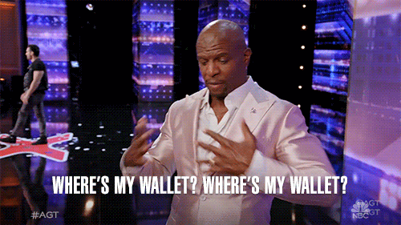
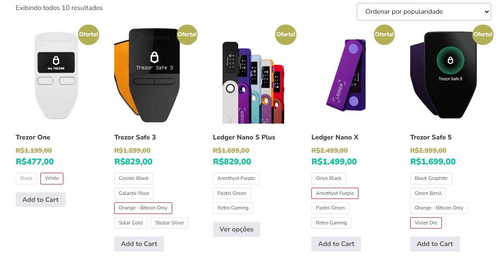
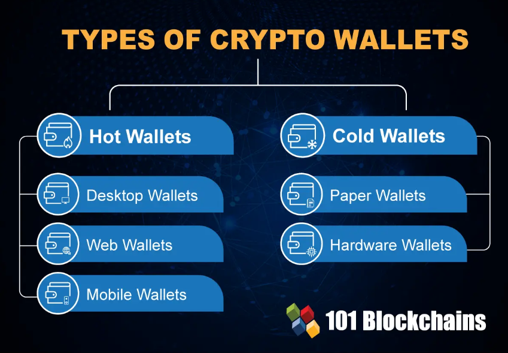
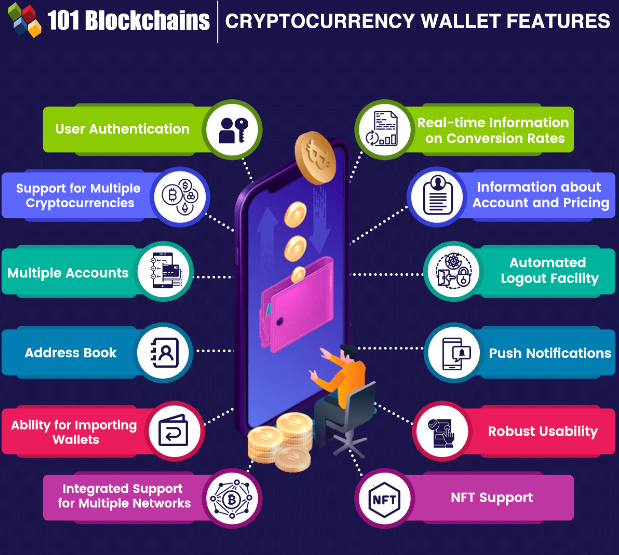

# Bitcoin na Prática

É fundamental entendermos que conceitos como 'saldo' em bitcoins não podem ser tratados de forma literal, isso porque não existe um lugar onde todos os seus bitcoins são guardados. A posse dos seus bitcoins se dá pela rede blockchain, onde blocos estarão endereçando *btcs* à sua chave pública e, para que você possa reendereçar e fazer transações na rede, você precisa da sua chave privada. Ou seja, possuir bitcoins é basicamente você guardar sua chave privada para adicionar novos blocos à rede.

Além disso, é importante destacar que cada chave pública possui sua própria chave privada.

## Wallets
Uma wallet é o meio termo entre uma carteira comum do dia-a-dia e um software de computador, feito para realizar transações dentro da rede blockchain. As *wallets* devem ter três características principais: **segurança**, **disponibilidade** e **conveniência**.

Existem várias *wallets* para armazenar *btcs*, sendo que algumas são mais fortes em uma característica do que em outra. **Veja abaixo:**

- **Carteira de Papel**: é literalmente você guardar sua CP/CS em um pedaço de papel, o que torna "impossível" de ser hackeada, porém, é uma folha de papel, com todas as incoveniências e fragilidade que podem existir de ter uma informação tão valiosa armazenada em algo tão simples;

- **Carteira de Hardware**: semelhante a um pequeno pen-drive que te permite ter vários pares de CP/CS, sendo extremamente seguras e possuindo várias vantagens como recuperação das moedas e outros serviços. Essas carteiras podem ser adquiridas em lojas especializadas e cada uma possui características específicas, veja abaixo:

Além disso, uma carteira de hardware possui uma semente, um dado que é possível linkar com novas carteiras, caso você perca sua carteira atual. Logo, é importante sempre guardar essa semente.

- **Carteira de Software**: software que podemos instalar para fazer operações na rede blockchain, sendo tão seguro quanto o seu desktop ou smartphone. Essas carteiras permitem que o usuário tenha múltiplos pares CP/CS, recuperação de moedas e outros tipos de serviços. Por fim, muitas dessas carteiras são adaptadas a mais de um tipo de moeda;

- **Carteira Online**: mais arriscada, porém mais mais prática, tendo vários serviços integrados, podendo ser utilizada via browser. Um grande problema é que os dados ficam nas nuvens, o que deixa eles muito vulneráveis.

## Exchanges
Exchanges são serviços que permitem você comprar, vender e negociar *btcs* online de forma "segura". Assim como qualquer outro ativo, o bitcoin pode ser negociado em vários mercados, serviços e moedas diferentes.

Exchanges funcionam de forma semelhante aos bancos, com a diferença de que elas não são reguladas, o que pode ser um ponto de fragilidade ao negociar com essas casas.
