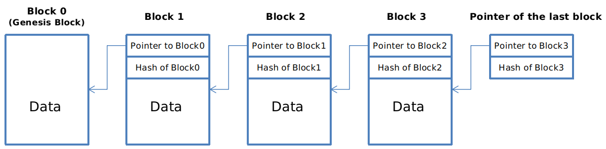
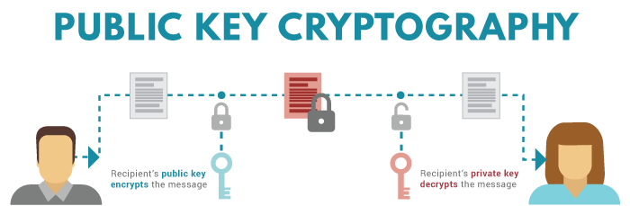
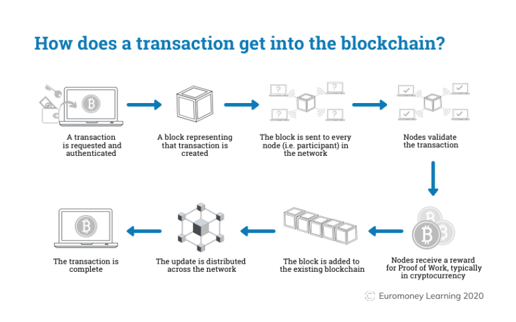
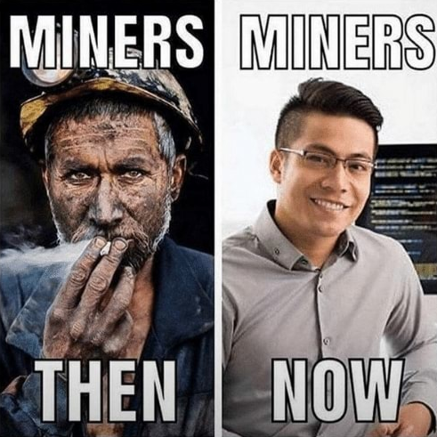
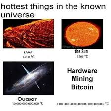
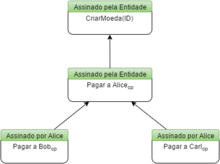

# Introdução à Blockchain e ao Bitcoin: entendendo o funcionamento básico

Uma sensação muito boa é saber que temos dinheiro guardado em alguma conta e que podemos usá-lo em uma eventual emergência. Mas você já parou para pensar o quão seguro é ter esse dinheiro guardado na conta?

**Existem muitos incógnitas quando paramos para analisar friamente:**

- Em uma conta, o dinheiro fica guardado de maneira fracionada, ou seja, o banco não mantém o valor integral disponível. Você deposita com a expectativa de que ele tenha o valor completo quando você solicitar. Um cenário improvável seria se todos decidissem sacar o dinheiro ao mesmo tempo. Como o banco reagiria? É algo para se pensar;

- Supondo que um juiz determinasse um bloqueio judicial na sua conta, você poderia chorar, implorar ao gerente do banco, mas não conseguiria reaver o dinheiro;

- Qualquer operação que você queira realizar com seu dinheiro não é feita por você; é você quem solicita ao banco, e ele a realiza.

E se eu dissesse a você que existe uma tecnologia que pode resolver esses problemas e oferecer mais segurança na hora de fazer uma reserva de valor? **Essa tecnologia é a Blockchain!**

---

## Blockchain
A blockchain é uma tecnologia que controla e garante a segurança da sua reserva de valor, não por meio de uma instituição financeira, mas sim através de um algoritmo. Ou seja, a própria rede é responsável por evitar fraudes!

O funcionamento de uma blockchain se assemelha muito ao de uma lista encadeada. Temos o que chamamos de hash pointer: blocos com ponteiros que sempre apontam para o bloco anterior, tendo acesso ao hash dele. Com isso, montamos uma rede em que um bloco valida o outro de forma sequencial. Em uma eventual fraude (vamos imaginar que alguém acessou uma conta e mudou uma informação para transferir dinheiro dessa pessoa para sua conta), a rede invalidaria essa transação porque o bloco à frente do que foi invadido conhece a informação real do bloco anterior, e a validação precisaria passar pela rede. A única forma de isso dar certo seria fraudar o bloco à frente, que também será validado no seguinte. Ou seja, para uma eventual fraude, o invasor precisaria reescrever toda a rede blockchain, basicamente.

Reescrever uma blockchain pode não ser um trabalho simples; além disso, é algo muito custoso, tanto do ponto de vista operacional quanto financeiro.

Porém, não é apenas isso que mantém a integridade de uma rede blockchain. Quando trabalhamos com um sistema que adota a blockchain em sua infraestrutura, utilizamos chaves públicas e privadas. Essas chaves garantem que as transações sejam realizadas com transparência e facilidade. *Vamos entender melhor…*

### Chave Privada
Para garantir uma transação, precisamos comprovar duas coisas: a identidade de quem envia e a identidade de quem recebe, sem deixar que ninguém se passe por quem envia. A chave privada serve para gerar assinaturas a partir de um input único que apenas o remetente conhece. Esse input, independentemente do seu tamanho, gera um hash feito através de operações matemáticas de tamanho padrão, o que torna improvável que seja decodificado. A única fragilidade é caso essa informação vaze, mas isso não diz respeito à segurança da blockchain, e sim à forma como o dono da chave privada lidou com essa informação.

### Chave Pública
Se a chave privada se refere à assinatura de quem está enviando, a chave pública se refere a quem recebe: essa é a chave pública. Ela verifica se a sua assinatura digital é autêntica, e qualquer um pode fazer isso ao ter acesso a ela.

Esse mecanismo de autenticação permite o uso da blockchain em diversas áreas, não apenas na financeira, mas também na autenticação e gerenciamento de energia, entre outras.

Chaves de autenticação são impossíveis de falsificar, fáceis de verificar e estão atreladas ao documento que foi autenticado.

### Blocos
O conceito de bloco, até aqui, está um pouco abstrato. Isso porque, antes de entender o conteúdo, precisamos compreender como eles estão organizados e como se comunicam. Os blocos são, basicamente, o registro das transações. A cada transação, um novo bloco é adicionado à rede, registrando a transferência de moedas. Essa operação passa por uma validação antes de ser realizada, que é feita em três passos:

1. Verificar a autenticidade da assinatura digital utilizada;
2. Verificar se a soma das moedas consumidas é maior do que as criadas (OBS¹: essa é uma forma de remunerar e manter uma rede blockchain. OBS²: moedas não são literalmente transferidas na práticas, mas sim destruídas e criadas novamente.);
3. Verificar se o remetente de fato tem a posse daquelas moedas utilizadas.

---

## Bitcoin
O Bitcoin, uma moeda digital descentralizada e de código aberta, é um exemplo muito prático de como funciona uma rede blockchain. Os nós para o funcionamento da rede do Bitcoin são milhares de computadores espalhados ao redor do mundo, em um sistema distribuído, sem hierarquia e em consenso, ou seja, não existe autoridade central para regular o funcionamento da rede, ele é feito inteiramente de forma algorítmica entre os nós da rede.

É possível se conectar a uma rede bitcoin de duas formas: via Bitcoin Client ou Wallet. Em qualquer uma dessas opções, já estamos conectados a rede e podendo enviar e receber transações, sendo que qualquer computador conectado a rede é um nó. Exitem dois tipos de nós: full node e lite node.

- **Full Nodes**: são os nós que mantém a rede blockchain funcionando, validando todas as transações emitidas pela rede e mantendo a consistência da blockchain;
- **Lite Nodes**: não armazenam toda a blockchain e necessitam de informações de outros nós para funcionar. Um exemplo desses nós são dispositivos com pouco poder de processamento que se conectem a rede.

Na prática, os mineradores são *full nodes* e as *wallets* podem (ou não) ser light nodes.

### Protocolo de consenso
Os mineradores tem um definitivo na rede: organizá-la, é o que chamamos de protocolo de consenso. Quando uma transação é realizada, o nó que está remetendo aquela operação começa a espalhar aquela informação para os outros nós ao seu redor. Os mineradores (full nodes) vão competir para pegar aquela informação e quando tiverem a posse de tal, realizar operações para transformar aquela solicitação no próximo bloco da rede, assim finalizando uma transação.

Por fim, isso torna praticamente impossível de uma transação ser fraudada, visto que ao colidir com uma operação falsa, esse nó não será validado pelos mineradores e o bloco não será adicionado a rede. A única forma de conseguir fraudar uma operação, seria um nó malicioso ter 51% de todo o poder de processamento da rede, para validar essa transação maliciosa, porém, por se tratar de uma rede distribuída, isso se torna muito improvável, para não dizer impossível, até porque estaríamos falando de um poder computacional muito grande.

---

## Proof of Work
Vamos explorar agora um protocolo que é responsável por fazer tudo funcionar: o proof of work. *Vamos começar a entender…*

### Nonce
O nonce é basicamente um valor numérico de zeros à esquerda da hash do bloco. Ganha o direito de adicionar o novo bloco a rede, o primeiro que acertar o número de zeros. Esse número isolado de zeros é chamado de dificuldade e ela foi pensada especialmente para que a cada 10 minutos, um novo bloco seja adicionado a rede. Ao fazer isso, os mineradores cumprem os requisitos da *proof of work*!

Como a rede blockchain é *puzzle friend*, ou seja, uma mudança muito pequena no input causa uma mudança muito grande no output, isso garante a integridade das operações para buscar o nonce.

Quando o nonce é encontrado, caso esteja correto, os outros mineradores começam a minerar em cima do bloco novo, caso contrário, continuam no bloco antigo. A partir daí vem o “consenso” da rede nas transações!

Os mineradores recebem uma taxa das transações que eles estão processando, o que torna viável essa atividade e a manutenção da rede blockchain, porém, essa ainda não é a forma oficial de remuneração dos mineradores, mas provavelmente será no futuro. Quando os mineradores encontram um bloco novo, eles também ganham o direito de criar uma nova quantidade de bitcoins e enviar os mesmos para as suas carteiras.

A cada ano essa quantidade de novos bitcoins criados diminui em 50% do seu valor total e como consequência, quando chegar a um valor próximo 0, vai parar. O valor inicial desses novos bitcoins criados eram 50 por transação.

**Um dia, no futuro, o total de bitcoins em circulação será 21 milhões.**

### Mining Pools
São nós coordenados por um nó central de mineração, em que ao um nó achar uma solução, ela é repassada para o nó central e por sua vez, o nó central repassa para os outros nós coordenados, deixando mais rápido e menos arriscado a mineração de bitcoins.

### Gasto Duplo
Gasto duplo é um problema considerável que outras criptomoedas não conseguiam resolver, fora o Bitcoin. Se trata de dois nós encontrarem as ramificações do próximo bloco e elas não entrarem em consenso, e diferentes nós começarem a minerar de forma paralela nesse bloco, gerando uma árvore de dados, extremamente complexa e inútil.

Para resolver isso, o proof of work estabelece como regra que a extensão da mineração sempre se dará no ramo mais longo da blockchain, ou seja, a ramificação que conseguir avisar mais nós da sua solução, se torna a oficial e os nós que estavam minerado na outra ramificação, deixam ela e vão para o ramo mais longo.

Nenhuma transação será perdida, visto que as transações que estavam em uma ramificação e não estavam na outra, serão adicionadas ao ramo oficial.

Dentro desse contexto, é sempre uma boa prática esperar até que um certo número de novos blocos sejam adicionados a rede para aprovar uma operação, visto que se alguém gerar uma nova ramificação maliciosa em uma transação, ela vai se tornar inútil porque novos blocos já vão ter minerado em cima da transação verdadeira.

**Finalizando…**
Esses foram as minhas anotações e resumos sobre os conceitos básicos de blockchain e bitcoin. *Abraço!*