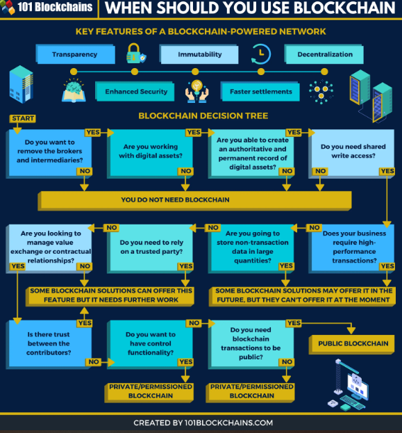

# Blockchain no Cotidiano

Até aqui, estudamos toda a parte teórica da Blockchain: como a rede é formada, como o sistema é distribuído, o que faz ela se manter, entre outras coisas. Porém, uma pergunta mais importante e que ainda não foi respondida é: *quando devo usar blockchain?*, ou melhor: *faz sentido MEU negócio investir em uma rede blockchain?* A partir desses questionamentos, podemos gerar alguns pontos de reflexão...

- Blockchain é uma tecnologia ainda muito nova e precisa de mais tempo de estudo e desenvolvimento;

- Blockchain não é uma solução para todos os problemas envolvendo segurança e fraude em redes;

- Um exemplo de utilidade de uma rede blockchain foi na colaboração entre *IBM*  com o *Walmart*, para conseguir rastrear cinco itens alimentares desde sua origem para garantir confiabilidade, autenticidade e frescor.

No mapa abaixo, podemos ter uma melhor ideia de quando (ou não) aplicar uma solução de blockchain:

Blockchain é uma tecnologia ainda embrionária, sendo um subtópico de outros subtópicos da Ciência da Computação, que por sí só já é uma ciência embrionário se comparada com química, física, matemática, etc.

Porém, isso não descaracteriza sua utilidade quando determinados pontos precisam ser preenchidos.