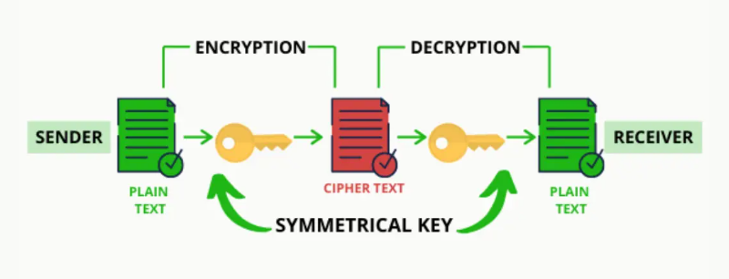
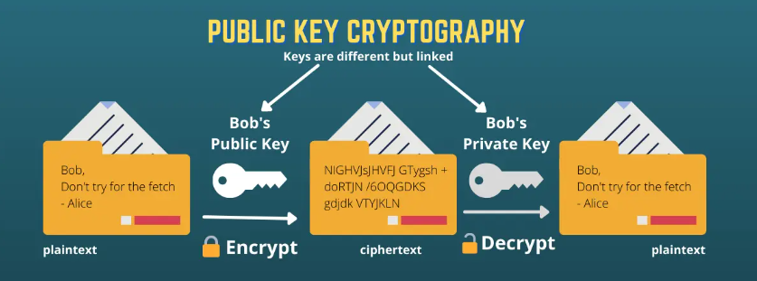

# Criptografia Blockchain
O blockchain é uma base de dados distribuída que garante segurança, descentralização, rastreabilidade e imutabilidade. Existem três tipos principais de blockchain: público, privado e de aliança. A segurança é essencial devido ao modelo de rede descentralizado, onde não há um único ponto de confiança, e a criptografia desempenha um papel crucial na proteção da integridade e privacidade dos dados.

A criptografia assegura a anonimidade, protege contra gastos duplos e evita a necessidade de autoridades centrais. Técnicas criptográficas, como chaves de encriptação e assinaturas digitais, garantem que apenas participantes autorizados acessem e verifiquem as informações.

## 1. Tipos de Criptografia
### 1.1 Assinaturas Digitais
Utilizam criptografia de chave pública para verificar a autenticidade de transações e documentos sem revelar a chave privada do usuário, assegurando confidencialidade, autenticidade, não-repúdio e integridade.

### 1.2 Hashing Criptográfico
É fundamental no blockchain para garantir a imutabilidade, criar "puzzles" criptográficos e verificar transações sem expor todo o bloco de informações. A função de hash, como o **SHA-256**, gera um código de comprimento fixo a partir de uma entrada, oferecendo benefícios como irreversibilidade e o efeito de avalanche (mudança mínima na entrada altera o hash completamente).

## 2. Aplicações, Benefícios e Carreira
A criptografia no blockchain permite prova de posse de dados sem divulgá-los, evita modificações não autorizadas, verifica transações e otimiza a largura de banda de transações. Com essas características, ela se alinha aos fundamentos do blockchain, como segurança e descentralização.

O conhecimento em criptografia de blockchain pode abrir oportunidades de carreira, destacando a importância de certificações especializadas em segurança de blockchain.

## 3. Riscos de Hackers x Funções de Hash Criptográficas
Hackers podem comprometer a assinatura digital dos usuários para realizar transações maliciosas ou alterar dados na blockchain de uma criptomoeda. A criptografia protege essas vulnerabilidades usando assinaturas digitais e funções de hash criptográficas.

As funções de hash criptográficas geram uma cadeia alfanumérica de comprimento fixo a partir de dados de qualquer tamanho, com características de determinação, rapidez, impossibilidade de reversão e variação drástica para pequenas alterações na entrada. No blockchain, elas identificam exclusivamente cada bloco e protegem assinaturas digitais. Essas funções hash são algoritmos que convertem dados de comprimento variável em uma sequência alfanumérica de tamanho fixo. No contexto blockchain, elas são fundamentais para criar assinaturas digitais e identificar blocos na cadeia de maneira única e irreversível. Suas principais características incluem a dificuldade de reverter o hash para o valor original e a sensibilidade a pequenas alterações no input.

Para validar transações, os mineradores comparam hashes gerados a partir do conteúdo da mensagem e da assinatura digital do usuário. Se os hashes coincidirem, a transação é considerada autêntica.

A segurança da rede blockchain é assegurada por uma estrutura onde cada bloco contém o hash do bloco anterior. Caso um hacker tente modificar um bloco, ele precisaria recalcular todos os hashes subsequentes, o que requer um poder computacional superior ao de toda a rede, o que é praticamente impossível.

Devido ao poder computacional necessário e à estrutura descentralizada da blockchain, adulterar transações ou blocos em uma blockchain pública é praticamente inviável.

## 4. Criptografia e Segurança de Transações: Chave Pública x Privada
### 4.1 Chave Pública
Inicialmente, a chave pública é um endereço público do usuário para receber criptomoedas, porém, além dela, podemos ter a criptografia de *Chave Pública*, também conhecida como criptografia assimétrica: essa técnica utiliza dois tipos de chaves: uma chave privada, que é mantida em segredo, e uma chave pública, que é visível a todos os participantes da rede. Essa abordagem permite a criptografia e a descriptografia de dados, garantindo que apenas o destinatário com a chave privada correspondente possa acessar as informações enviadas.

O algoritmo **RSA (Rivest-Shamir-Adleman)** é frequentemente utilizado para transmitir dados sensíveis. Ele proporciona segurança, confidencialidade e autenticidade na comunicação, resolvendo problemas associados à troca segura de chaves em sistemas simétricos.

Este método é essencial em ambientes com muitos usuários, pois elimina a complexidade de gerenciar a troca de chaves secretas, oferecendo uma solução mais escalável e segura em comparação com a criptografia simétrica tradicional.

| Nome | Descrição |
| ----------- | ----------- |
| Autenticação | As assinaturas digitais garantem que apenas o proprietário da chave privada correspondente possa realizar transações. |
| Proteção da Integridade | Assegura que as transações ou blocos não sejam alterados durante a transmissão entre os nós da rede. |
| Gestão de Identidade | As contas são baseadas em chaves públicas, permitindo anonimato e autenticação sem comprometer a identidade real dos usuários. |

Esse método oferece melhor segurança de dados, não exige a transmissão de chaves privadas, e garante não-repúdio, ou seja, os usuários são responsáveis por proteger suas chaves privadas.

Apesar de suas vantagens, a criptografia de chave pública pode ser mais lenta ao lidar com grandes volumes de dados. Além disso, a segurança depende da proteção da chave privada, que, se perdida ou comprometida, pode resultar em perda de acesso aos dados criptografados. A criptografia de chave pública é fundamental para a segurança da blockchain, proporcionando verificação segura de propriedade e transmissão de dados, além de suportar a integridade e privacidade necessárias em um ambiente digital moderno. A crescente demanda por segurança em blockchain destaca a relevância de carreiras especializadas na área.

### 4.2 Chave Privada
Os usuários criam um hash criptográfico da transação e, junto com a chave privada, geram uma assinatura digital. Os mineradores verificam a transação comparando o hash e a assinatura; se houver correspondência, a transação é validada. Deve ser protegida, pois sua exposição permite que hackers acessem os fundos do usuário. É fácil gerar a chave pública a partir da privada, mas o processo inverso é inviável.

Hackear uma assinatura digital requer um poder computacional gigantesco, o que torna a alteração da transação inviável (estima-se que levaria 5 quindecilhões de anos).

Cada bloco contém o hash do bloco anterior, detalhes das transações, o endereço do minerador e um número aleatório. Para alterar um bloco, hackers precisariam resolver hashes de forma a manter a integridade da cadeia, o que é inviável devido à necessidade de computação exponencial.

Com milhares de mineradores adicionando novos blocos constantemente, alterar um bloco comprometeria toda a cadeia subsequente, alertando outros mineradores. Hackear toda a rede blockchain exigiria mais poder computacional do que o disponível na rede.

## 5. Hashing em Criptografia
Hashing é uma técnica de ciência da computação que atribui um número de identificação único a cada objeto ou valor em um grupo. Exemplos incluem números de matrícula em escolas e identificações de livros em bibliotecas. No contexto da criptografia, hashing refere-se à geração de um valor de saída de comprimento fixo a partir de uma entrada de qualquer tamanho. Por exemplo, ao usar o algoritmo de hashing SHA-256 com a entrada “Hello, World!”, o resultado é um hash único.

As funções de hash têm características importantes:
- *Determinística*: A mesma entrada sempre gera a mesma saída;
- *Resistência à Pré-imagem*: O valor hash não pode ser usado para descobrir a entrada original;
- *Eficiente Computacionalmente*: As funções de hash são rápidas e não exigem muitos recursos;
- *Irreversível*: Não é possível reverter o hash para encontrar a entrada original;
- *Resistência a Colisões*: Não deve haver duas entradas que gerem a mesma saída.

As funções de hash convertem grandes entradas em saídas de tamanho fixo, que são armazenadas em tabelas de hash. A estrutura de chave/valor permite acesso rápido aos elementos, com um tempo de acesso médio de *O(1)*.

**Existem dois métodos para implementar funções de hash**:
- Converter um elemento em um inteiro e usá-lo como chave para acessar elementos na tabela de hash;
- Armazenar o elemento na tabela de hash e recuperá-lo usando a chave hash.

**Características de uma Boa Função de Hash**:
- Seja fácil de computar;
- Produza uma distribuição uniforme para evitar agrupamentos (clustering);
- Minimize colisões, embora não seja possível eliminá-las completamente.

As colisões são inevitáveis em funções de hash, mas técnicas de resolução de colisões podem ser implementadas para melhorar o desempenho da tabela de hash.

## 6. A importância do Nonce em Blockchain
Nonce é uma abreviação de "número usado uma vez". É um número aleatório utilizado apenas uma vez no processo de mineração de criptomoedas, essencial para garantir a validade ao calcular o hash de um bloco. O nonce é crucial para o funcionamento do mecanismo de consenso Proof of Work, onde os mineradores precisam encontrar um nonce que resulte em um hash válido para adicionar novos blocos à blockchain. O uso do nonce ajuda a evitar a duplicação e o gasto duplo de criptomoedas.

Os mineradores tentam adivinhar o nonce correto, testando múltiplos valores até encontrar um que produza um hash abaixo de um limite predefinido. Este processo de tentativa e erro pode exigir milhões de tentativas, pois a busca pelo nonce ideal é comparável a um método de força bruta.

O nonce é um número aleatório de 32 bits, tornando difícil sua adivinhação. O tempo necessário para encontrar um nonce válido pode variar conforme a dificuldade de criar um hash abaixo do alvo.

O sucesso na mineração de nonce é influenciado pela potência computacional dos mineradores. Quanto mais poderosos forem os recursos computacionais, maior a probabilidade de encontrar rapidamente o nonce correto. O número de mineradores ativos também pode aumentar a dificuldade de encontrar um nonce único.

O nonce pode ser utilizado em protocolos de autenticação para proteger comunicações de reprocessamento. É aplicável em sistemas de hashing, vetores de inicialização para criptografia, e ferramentas de assinatura eletrônica para garantir a autenticidade.

O nonce é fundamental no ecossistema de blockchain, especialmente em sistemas Proof of Work, proporcionando segurança e eficiência. Os desafios na sua determinação são influenciados por fatores como a rede de mineradores e o hardware utilizado. As aplicações do nonce vão além da mineração, incluindo segurança em comunicações e criptografia.
