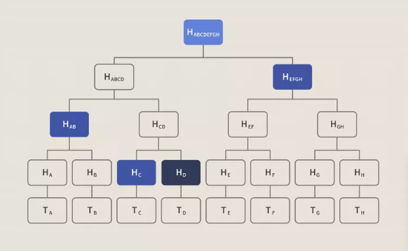

# Árvore de Merkle

## Definição
- Árvore de Merkle é uma estrutura de dados usada para verificar de forma segura grandes conjuntos de dados de forma eficiente e consistente;
- É amplamente utilizada no Ethereum e no Bitcoin;
- Problema: Em redes centralizadas, os dados estão em uma única cópia, facilitando o acesso. Já em redes descentralizadas (como blockchain), os dados são duplicados entre os nós, criando desafios de verificação.
- Solução: Árvores de Merkle permitem compartilhar e verificar dados em redes descentralizadas, otimizando o uso de energia e garantindo segurança por meio de funções hash e criptografia.

## Funções Hash Criptográficas
- Função hash mapeia dados de qualquer tamanho para uma saída de tamanho fixo, sendo uma função criptográfica eficiente e de via única (não reversível);
- Exemplo: usando o algoritmo SHA256 com "101Blockchains", o hash resultante é `fbffd63a60374a31aa9811cbc80b577e23925a5874e86a17f712bab874f33ac9`;
- Propriedades importantes: determinístico, resistente a pré-imagem, eficiente e resistente a colisões.

## Funcionamento das Árvores de Merkle
- Em uma árvore de Merkle, os nós folha contêm os hashes das transações, enquanto os nós não-folha armazenam o hash dos dois nós filhos anteriores;
- O processo de hash continua até restar um único hash, conhecido como Merkle Root (Raiz de Merkle);
- Árvores de Merkle são binárias, exigindo um número par de nós folha. Se houver um número ímpar, o último nó é duplicado.

## Exemplo
- Suponha quatro transações (X, Y, Z e W), que são hashadas em Hash X, Hash Y, Hash Z e Hash W;
- Esses hashes são combinados em Hash XY e Hash ZW, e depois combinados novamente para formar a Merkle Root.

## Verificação de Integridade de Dados
- Árvores de Merkle são ideais para verificação de integridade. Não é necessário verificar todas as transações; a verificação pode ser feita a partir de uma ramificação específica da árvore, utilizando os Merkle Proofs.

## Uso de Árvores de Merkle no Bitcoin
- Bitcoin usa SHA-256 para gerar hashes. Cada bloco no blockchain contém um cabeçalho com informações, como a Raiz de Merkle e o hash do bloco anterior;
- O sistema facilita a Verificação Simples de Pagamento (SPV), onde clientes leves podem verificar transações sem baixar todo o blockchain.

## Uso de Árvores de Merkle no Ethereum
- Ethereum utiliza uma versão mais complexa, chamada Árvore de Merkle Patricia, devido à sua capacidade de execução completa (Turing-complete);

## Outras Implementações de Árvores de Merkle
- Árvores de Merkle são usadas em sistemas distribuídos, como o Git e o Interplanetary File System (IPFS);
- Autoridades certificadoras utilizam árvores de Merkle para logs transparentes de certificados;
- Bancos de dados No-SQL, como Amazon DynamoDB e Apache Cassandra, usam árvores de Merkle para verificar consistência durante a replicação de dados.

## Benefícios das Árvores de Merkle
- Validação da integridade dos dados;
- Uso eficiente de espaço em disco;
- Verificação rápida de dados com pequenas porções de informação;
- Otimização na sincronização e verificação de dados em redes distribuídas.
