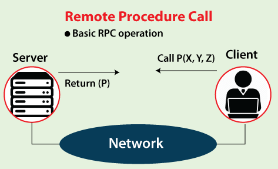
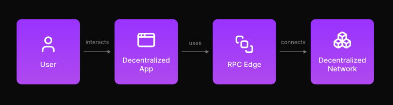

# RPC (Remote Procedure Call)

## Introdução
- RPC é um protocolo de comunicação leve que permite que programas se comuniquem com outros programas em redes diferentes, sem precisar de detalhes sobre o servidor;
- O RPC executa sub-rotinas no servidor para atender às solicitações de um cliente.

## RPC na Blockchain
- O RPC conecta aplicativos descentralizados (dApps) com redes de blockchain, permitindo que obtenham dados necessários para funcionar corretamente;
- No modelo cliente-servidor, o dApp atua como o cliente, enquanto o nó RPC serve como o servidor.

## Nó RPC
- Um nó RPC é um computador que roda o software de um cliente blockchain, capaz de responder a solicitações RPC;
- Exemplos incluem nós no Ethereum (nós completos, leves ou de arquivo) e no Solana (nós validadores e RPC);
- Exemplo: No Solana, os nós RPC fornecem dados do blockchain para dApps e permitem interações com a rede.

## Endpoints RPC:
- Um endpoint RPC é o local na rede onde um programa envia suas solicitações para acessar dados do servidor;
- Conectar um dApp a um endpoint RPC permite acessar dados do blockchain em tempo real;
- *Públicos*: Gratuitos e disponíveis para todos, mas com limitações em termos de taxa de uso e sem suporte ao cliente;
- *Privados*: Exclusivos para um dApp, com maior velocidade e confiabilidade, ideal para aplicações em produção;
- Alternativos: Usados como backups para evitar a falha de um endpoint principal.

## Funcionamento de um Nó RPC:
- O nó RPC funciona como um intermediário, recuperando dados da blockchain e enviando de volta ao dApp, normalmente usando o protocolo JSON-RPC;
- Métodos JSON-RPC: São usados para solicitar serviços, como acessar dados históricos, monitorar blocos ou obter o estado atual do blockchain.

## Utilização de Provedores de Nó RPC:
- Provedores de Nó RPC gerenciam a configuração, manutenção e operação de nós para desenvolvedores, garantindo que seus dApps funcionem corretamente;
- Exemplos de provedores populares incluem Alchemy, que oferece endpoints para blockchains como Ethereum, Arbitrum e Solana.

## Executando Seu Próprio Nó RPC:
- Desenvolvedores podem optar por rodar seu próprio nó RPC para obter maior controle sobre a configuração;
- Isso envolve a escolha do cliente, ambiente de sistema e sincronização do nó, o que pode ser mais demorado.

## Impacto no Desenvolvimento de Web3:
- RPC Nodes são fundamentais para conectar dApps a várias redes blockchain e garantir que as aplicações possam acessar dados necessários para suas operações;
- Provedores de nó estão ajudando a escalar o desenvolvimento web3, ao simplificar a infraestrutura necessária para que os desenvolvedores criem novos produtos sem se preocupar com a complexidade de gerenciar seus próprios nós.
