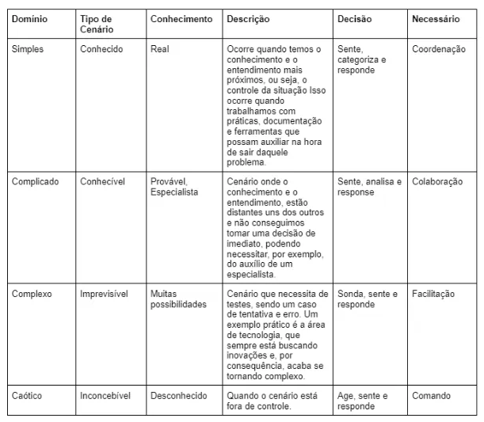

# Scrum

Quando estamos em um ambiente corporativo e de projetos, podemos ter duas formas de trabalhar: metodologias tradicionais e metodologias ágeis. Nas metodologias tradicionais, temos um planejamento robusto e longo, prevendo todas as etapas do projeto, implementação e prazos. Porém, essas metodologias, por possuírem etapas dependentes umas das outras, acabam se tornando burocráticas, não conseguem dar transparência ao cliente e não abrem espaço para imprevistos.

Em uma metodologia ágil, trabalhamos de forma diferente, com um planejamento mais enxuto, em que as pessoas têm funções diferentes (sem uma hierarquia de “poderes”) e as implementações são feitas gradualmente, permitindo espaço para mudanças, imprevistos e transparência para o cliente.

## O que é o Scrum?

Dentro desse contexto, o *Scrum* é um fluxo de trabalho que implementamos no processo de uma empresa, para que ela funcione com uma mentalidade ágil.

Em um time *Scrum*, existem três atores principais. Veja abaixo:

### Scrum Master

Responsável por garantir o funcionamento pleno do time, se atentando desde o básico, como a falta de energia na empresa — por exemplo — até a saúde dos membros. Além disso, também tem como objetivo, garantir que o time esteja seguindo os princípios do Scrum, motivar o time, entre outras funções que envolvam a gestão de pessoas no time.

### Product Owner

Responsável por manter o contato com o cliente e ser essa ponte entre o time de desenvolvedores e as demandas pedidas pelo cliente, utilizando técnicas de engenharia de requisitos — por exemplo — para ter o melhor entendimento do trabalho que será realizado. Eventualmente atua com o Scrum Master para garantir a qualidade do produto.

### Desenvolvedores

Os desenvolvedores serão quem de fato irão desenvolver a parte técnica do projeto e que estarão sob cuidados do *Scrum Master* e atuarão com as demandas trazidas pelo *Product Owner*.

## Sprint e fragmentação do trabalho

Na metodologia *Scrum*, trabalhamos com sprints: um ciclo em que determinadas tarefas devem ser realizadas em um determinado período de tempo, tendo duração mínima de uma semana e duração máxima de quatro semanas. Uma sprint pode ser abortada ou reiniciada, a depender do cenário, como o cliente pedir alterações urgentes ou um problema urgente envolvendo o time de desenvolvedores, por exemplo.

**Uma sprint é constituída de etapas. Veja abaixo:**

### Sprint Planning

Reunião realizada no início de cada sprint em metodologias ágeis, como o Scrum. O objetivo é definir quais tarefas o time vai executar durante o *sprint*, alinhando a equipe sobre as prioridades e dividindo as atividades entre os membros. Nela, o *Product Owner* apresenta os itens do *product backlog¹*, e o time, junto com o Scrum Master, discute e estima o esforço necessário para completar as tarefas selecionadas.

### Sprint Backlog

Lista de tarefas que a equipe de desenvolvimento se compromete a completar durante uma *sprint*. Ele é derivado do *Product Backlog*, contendo os itens mais prioritários selecionados durante a *Sprint Planning*. O Sprint Backlog inclui não apenas as funcionalidades que serão desenvolvidas, mas também as tarefas técnicas e ajustes necessários para concluir o trabalho. É um artefato dinâmico que pode ser ajustado pela equipe durante o sprint, conforme necessário, para garantir que as metas do sprint sejam atingidas.

### Daily Scrum

Breve reunião diária, geralmente de 15 minutos, realizada pela equipe de desenvolvimento. O objetivo é sincronizar as atividades do time, identificar impedimentos e ajustar o plano de trabalho para o dia. Cada membro da equipe responde a três perguntas: o que fez no dia anterior, o que planeja fazer no dia atual e se há algum obstáculo. Isso ajuda a manter o time alinhado e a garantir a progressão contínua do *sprint*. Eventualmente, o *Scrum Master* e/ou *Product Owner* podem participar para entender como está o processo e auxiliar para que a sprint seja entregue no prazo.

### Sprint Review

Reunião realizada no final de cada sprint, onde o time apresenta o trabalho concluído para o *Product Owner* e demais *stakeholders*. O objetivo é inspecionar o incremento de produto desenvolvido e obter feedback. Durante a revisão, o time demonstra as funcionalidades finalizadas e discute o que foi feito em relação ao que estava planejado. Essa sessão também permite ajustes no *Product Backlog*, com base nas sugestões e mudanças de prioridade identificadas.

### Sprint Retrospective

Reunião realizada ao final de cada sprint , porém, diferente da sprint review, nessa reunião a equipe reflete - especificamente - sobre o processo de trabalho utilizado. O objetivo é identificar o que funcionou bem, o que pode ser melhorado e quais ajustes podem ser feitos para aumentar a eficiência e colaboração nas próximas *sprints*. A equipe discute problemas, boas práticas e oportunidades de melhoria, criando um plano de ação para otimizar o desempenho e o relacionamento do time.

**Product Backlog¹:** versão específica do backlog no Scrum, que contém todas as funcionalidades, melhorias, correções e requisitos que precisam ser desenvolvidos para o produto final. Ele é constantemente atualizado e priorizado pelo Product Owner, com base no valor para o cliente e nas necessidades do negócio. Os itens mais importantes e detalhados ficam no topo para serem abordados nas próximas sprints, enquanto os itens menos prioritários permanecem mais gerais e podem ser refinados posteriormente.

## Ferramentas Scrum
Além de termos atores e processo, em uma metodologia Scrum, também temos ferramentas que podem nos ajudar a desenvolver o projeto e auxiliar no processo. Veja abaixo:

### User Stories
Descrições simples e curtas de funcionalidades ou requisitos do ponto de vista do usuário final. Essas “historinhas” ajudam a equipe de desenvolvimento a entender o valor de uma funcionalidade para o usuário final. Uma user story geralmente segue o formato: “Como [tipo de usuário], eu quero [ação/funcionalidade] para [benefício/resultado esperado]”. Essas histórias são intencionais para serem discutidas e detalhadas conforme necessário durante a sprint, priorizando o valor entregue ao usuário e permitindo flexibilidade no desenvolvimento. Exemplo: “Como usuário do Instagram, eu quero poder postar uma foto no meu feed para que meus amigos possam ver e comento”. A partir disso, podemos extrair subtarefas para adicionar ao Sprint Backlog, como configurar uma banco de dados para receber essa image, construir rotas em uma API que faça essa comunicação, etc.

### Story Points
Unidade de medida usada para estimar o esforço necessário para completar uma user story ou tarefa. Eles são atribuídos pelo time de desenvolvimento durante a Sprint Planning com base na complexidade, incerteza e volume de trabalho envolvido. Em vez de medir o tempo, os pontos indicam a dificuldade relativa entre diferentes tarefas. Isso ajuda a equipe a planejar melhor a carga de trabalho de uma sprint, garantindo que as entregas sejam realistas e equilibradas.

### Framework Cynefin
Esse framework trata de analisar uma situação em um projeto e categorizar ela. Nesta abordagem, podemos categorizar uma situação ou ambiente de quatro formas, denominadas domínio. Veja abaixo:

### Quadro Kanban
Representação visual - podendo ir desde um quadro com post-it até um software específico para isso - usada para gerenciar o fluxo de trabalho, permitindo acompanhar o progresso das tarefas de uma sprint, por exemplo. Ele é dividido em colunas, que representam as etapas do processo (como “A fazer”, “Em andamento” e “Concluído”). Um software que fornece essa ferramenta virtualmente é o Jira.

### Jira
Software que permite o monitoramento de tarefas e acompanhamento de projetos garantindo o gerenciamento de todas as suas atividades em único lugar, em uma metodologia ágil.

## Conclusão…
Esse foi o meu resumo sobre Scrum e metodologias ágeis, espero que tenha sido útil de alguma forma. **Abraço!**

